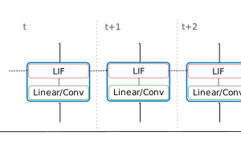

# SNN required features

This repository is supposed to demonstrate the features that are ideally needed to implement efficient multi-layer spiking neural networks (SNNs).

The repository limits itself to a simple smallest building block consiting of a Linear layer (either implemented as `tensorflow.keras.layers.Dense` or a custom `sparse_snns.nn_sparse.SparseLinear`) with a recurrent leaky integrate and fire (LIF) layer `LIFNeuron`. Together these form the `SNNBlock`. Multi-layer SNNs are then build by stacking multiple `SNNBlock`s

The `LIFNeuron` implements the dynamics of simple leaky integrate and fire (LIF) neuron with two internal states

Here, the synaptic input current of neuron i is calcualted based on the spikes coming from connected pre-synaptic neurons j and the corresponding synaptic weights:

In it's simplest form the calculation of the synaptic input can be implemented as a standard neural network layer, like a linear or convolutional layer.

## Key Challenges

The following summarizes the key challanges.

### 1. Efficient LIF

First, the idea would be to have an efficient implementation of the LIF block, similar to the implementation of the poplibs LSTM/GRU. It would be useful if both linear/dense transformations as well as convolutions would be supported, but probably this would be implemneted in two separate layers?

As the output of a LIF layer represent spikes, which are mostly zero, it would probably be most efficient to handle the spikes as sparse, rather than dense tensors. As the sparsity structure changes every timestep, support of some for of dynamic sparsity is necessary in order to realize sparse LIF layers.

### 2. Distributed LIF Network

Eventually, the goal is to build large multi-layer spiking neural networks. Here the it should be noted that spiking neural networks can take a different compared to the traditional multi-layer recurrent neural networks. Traditional multi-layer RNNs work by simply sequentially stacking multiple RNN layers together in a strict feed-forward fashion. Multi-layer SNNs, however, can have an arbitrary graph-like structure with an arbitrary connectiviry between the different nodes/layers.

Unrolled in time the compuation graph takes a similar for as the standard multi-layer RNN.

However, note, that there are no direct connections between blocks within one time-step. Information can only flow between blocks between two timesteps. Therefore the block-wise computations within one timestep are independet from each other. In our eyes this naturally matches the IPUs 3-step computation scheme. Additionally, the communication should be rather sparse due to the outputs only being spikes, while the dense states remain local.

Lastly, it would interesting to see the IPUs performance for pure inference of the SNN. While training with backpropagation through time (BPTT) is still the dominant training method, it has the downside that the intermediate states have to be stored for the full time sequence. If we understand this correctly, this prevents a true dynamic unroll in time (as the memory cost increases linearly in time). Nonetheless, it would be nice to see the performance of the IPU for a true dynamic unroll (as it seems to be the more fitting mode).

## Repository Structure

The following outlines the structure of the repository:

1. In `./dense_snns/` you can find the base implementation, as it implements the SNN in the standard multi-layer RNN framework, where multiple SNN layers are stacked in a sequential manner. This is possible either via stacking multiple `tensorflow.keras.layers.RNN`s with `return_sequences` set to `True`, or via multiple cells wrapped by a single `tensorflow.keras.layers.RNN`.
2. `./sparse_snns/` builds on top of `dense_snns`, where now the `LIFNeuron`'s outputs are replaced with sparse instead of dense tensors. (Here, some workarounds are necessary as not the full functionality is supported in tensorflow, making the SNN implementation less efficient.)
3. Lastly, in `./snns_as_gnn/` we want to highlight the similarity between SNNs and graph neural networks (GNNs). Eventually, `SNNBlock`s are not supposed to be stacked in a sequential manner, but to be connected in an arbitrary graph like structure. At the moment, the easiest way to implement this, seems to be an approach based on the `tensorflow.keras.layers.RNN` with a single cell. This, however, as far as we understood, prevents parallization onto multiple IPUs.

## Relevant Papers
