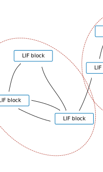

# SNN required features

This repository is supposed to demonstrate the features that are ideally needed to implement efficient multi-layer spiking neural networks (SNNs).

The repository limits itself to a simple smallest building block consiting of a Linear layer (either implemented as `tensorflow.keras.layers.Dense` or a custom `sparse_snns.nn_sparse.SparseLinear`) with a recurrent leaky integrate and fire (LIF) layer `LIFNeuron`. Together these form the `SNNBlock`. Multi-layer SNNs are then build by stacking multiple `SNNBlock`s

1. In `dense_snns` you can find the base implementation, as it implements the SNN in the standard multi-layer RNN framework, where multiple SNN layers are stacked in a sequential manner. This is possible either via stacking multiple `tensorflow.keras.layers.RNN`s with `return_sequences` set to `True`, or via multiple cells wrapped by a single `tensorflow.keras.layers.RNN`.
2. `sparse_snns` builds on top of `dense_snns`, where now the `LIFNeuron`'s outputs are replaced with sparse instead of dense tensors. (Here, some workarounds are necessary as not the full functionality is supported in tensorflow, making the SNN implementation less efficient.)
3. Lastly, in `snns_as_gnn` we want to highlight the similarity between SNNs and graph neural networks (GNNs). Eventually, `SNNBlock`s are not supposed to be stacked in a sequential manner, but to be connected in an arbitrary graph like structure. At the moment, the easiest way to implement this, seems to be an approach based on the `tensorflow.keras.layers.RNN` with a single cell. This, however, prevents parallization onto multiple IPUs, altuogh the computations are independent from each other and communication between different nodes/blocks is only necessary before/after each timestep.

While training with backpropagation through time (BPTT) is still the dominant training method, it has the downside that the intermediate states have to be stored for the full time sequence. If we understand this correctly, this prevents a true dynamic unroll in time (as the memory cost increases linearly in time). Nonetheless, it would be nice to see the performance of the IPU for a true dynamic unroll (as it seems to be the more fitting mode) which would be useful for inference (and potentially as well for training with alternative training algorithms at some point).

## Key Challenges

The following summarizes the key challanges.

### Efficient

1. Efficient implementation of a LIF-RNN layer (similar to the poplibs LSTM/GRU)  
    It would be useful if both linear/dense transformations as well as convolutions would be supported, but probably this would be implemneted in two separate layers?
    

2. Support for dynamic sparsity of the LIF-layers input and output
    

3. Parallelization of SNN-Networks with multiple layers that form an arbitrary graph like structure.
    

    Unrolled in time the compuation graph takes a similar for as the standard multi-layer RNN. However, note, that there are no direct connections between blocks within one time-step, but information can only flow between blocks between two timesteps. Therefore the block-wise computations within one timestep are independet from each other.
    

4. True dynamic unroll for inference (meaning no linear increase in memory with time)

While 1. and 2. target a SNN-layer implementation in poplibs, 3. probably requires a different approach to parallelization in tensorflow. Therefore 3. is probably more general and not specific to SNNs. 
